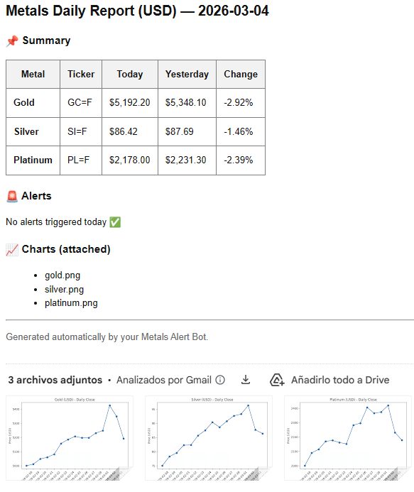
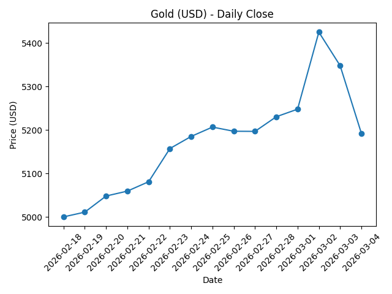

# 📊 Precious Metals Alert Bot


> Automated monitoring system for Gold, Silver and Platinum prices with daily reports, historical tracking, chart generation and real-time email alerts.
---

## 🚀 Overview

This project is an end-to-end automated financial monitoring system that tracks daily closing prices of precious metals (Gold, Silver, Platinum), stores historical data locally, generates price charts, and sends automated email reports and alerts.
The system runs automatically every day at 09:00 using Windows Task Scheduler.

---

## 🎯 Why This Project Matters

Financial markets generate large amounts of data daily.  
This project demonstrates how to:

- Automate real-world data pipelines
- Persist historical financial data reliably
- Detect price anomalies through comparison logic
- Generate visual insights automatically
- Deliver structured reporting via email
- Deploy scheduled automation in a production-like environment

It simulates a real monitoring system that could be extended to:
- Stock portfolios
- Cryptocurrency tracking
- Commodity monitoring
- Automated business reporting systems
---

## 📸 Demo

### 📧 Daily Email Report



### 📊 Generated Chart Example




## 🔎 Features

📈 Fetches live market data from Yahoo Finance (no paid API required)
🗄 Stores historical data in SQLite
🔁 Prevents duplicate daily entries using UPSERT logic
📊 Generates historical price charts automatically
📬 Sends professional HTML daily reports via email
🚨 Sends real-time alert emails if price variation exceeds a defined threshold
⏰ Fully automated daily execution

---

## 🏗 System Architecture
```
Yahoo Finance (yfinance)
        ↓
Python Data Processing
        ↓
SQLite Database (Historical Storage)
        ↓
Price Comparison Logic
        ↓
Chart Generation (matplotlib)
        ↓
Email Reporting System (SMTP)
        ↓
User Inbox
```

---

## 🛠 Tech Stack

- Python 3.11
- yfinance
- SQLite
- matplotlib
- smtplib
- python-dotenv
- Windows Task Scheduler

---

## 📂 Project Structure

```
precious-metals-alert-bot/
│
├── src/
│   ├── main.py
│   ├── db.py
│   ├── provider.py
│   ├── charts.py
│   ├── alerts.py
│   ├── emailer.py
│   └── config.py
│
├── data/
├── docs/charts/
├── requirements.txt
├── .gitignore
└── README.md
```

---

## ⚙️ Installation

### Clone repository

```bash
git clone https://github.com/YOUR_USERNAME/precious-metals-alert-bot.git
cd precious-metals-alert-bot
```
```Create virtual environment:
python -m venv venv
venv\Scripts\activate
```
```Install dependencies:
pip install -r requirements.txt
```

Create a .env file:
GMAIL_USER=your_email@gmail.com
GMAIL_APP_PASSWORD=your_google_app_password
ALERT_THRESHOLD=6

## ▶️ Run manually

```bash
python -m src.main

```

⏰ Automation
This project uses Windows Task Scheduler to execute daily at 09:00.
If the system is powered off at that time, it runs automatically at the next startup.

📧Daily email includes:
Metal
Ticker
Today's price
Yesterday's price
Percentage change
Alert section
Attached price charts

💡 What This Project Demonstrates
Real-world automation
Financial data extraction
SQL UPSERT logic
Data visualization
Email automation
Scheduled execution
Secure credential handling
End-to-end system design

---

## 🚀 Future Improvements

- 🌐 Web dashboard using GitHub Pages
- 📊 Interactive long-term charts (15+ years historical data)
- 👤 User registration system
- 📬 Customizable alert subscriptions
- ☁️ Cloud deployment (AWS / Render / Railway)
- 🔐 Authentication & user management
- 📡 REST API version

---

## 👨‍💻 Author

Juan Bautista  
Software Development & Cybersecurity Background  
GitHub: https://github.com/soyjuanjg-dev
